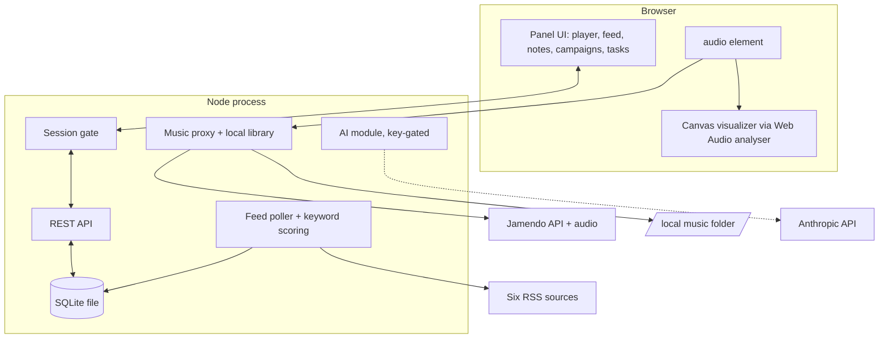

# feat: Build EDMissions rave console v1

## Summary

Build EDMissions as one Node process serving a vanilla-JS single-page dashboard: Jamendo-streamed music with an audio-reactive visualizer across three intensity modes plus off, an enrollment-ranked RSS feed, a subject-tagged research hub, a campaign builder with handoff and one-shot AI paths, manual tasks, and an env-credential login gate. SQLite for storage, Docker for deployment to the owner's existing Hetzner server. Running without an AI key is the "lite" configuration (see origin: docs/brainstorms/2026-07-12-edmissions-rave-console-requirements.md).

## Problem Frame

Greenfield build. The origin doc carries the full product frame: a daily-driver dashboard for a higher-ed enrollment professional where the music and visuals are the reason it gets opened. The friend (A1) is the primary user; the owner (A2) deploys, holds keys, and logs in for review.

---

## Requirements

R-IDs mirror the origin doc one-for-one; each unit cites the IDs it advances.

**Music and modes** — R1 Jamendo streaming with discovery and controls; R2 three modes + off switchable from the main view; R3 config-editable genre pools (intense → hard EDM/techno, vibing → melodic house, chill → lofi/ambient/bluegrass); R4 visualizer renders from real audio analysis, intensity per mode; R5 off silences audio, static background, rest unaffected; R6 local-folder playback as Jamendo fallback.

**Article feed** — R7 poll configurable RSS sources (six at launch); R8 keyword scoring ranks enrollment articles first, list config-editable; R9 headline/source/date/excerpt only, link out, no full text; R10 starring with starred filter; R11 add-to-notes creates a pre-filled note.

**Research hub** — R12 notes store raw text, created from scratch/paste/add-to-notes; R13 configurable subject tags with filtering; R14 on-demand AI summary kept alongside raw.

**Campaign builder** — R15 form captures purpose, CTA, CTA link, message count; R16 handoff brief renders without any key; R17 in-app generation offered only when key present; R18 templates and outputs saved and reviewable.

**Tasks** — R19 manual CRUD, no automation.

**Access and deployment** — R20 login with env-defined username/password pairs, no registration or roles; R21 single-tenant shared workspace; R22 same codebase runs locally and as a Docker container behind a reverse-proxy subdomain; R23 all env vars `EDMISSIONS_`-prefixed; R24 AI features hidden and everything else functional when no key is set.

---

## Key Technical Decisions

- **Express + vanilla no-build frontend.** One `npm start`, no bundler, no framework. Six panels and a canvas don't justify a toolchain; ES modules served statically keep the lite-run promise (user-confirmed).
- **`node:sqlite` on Node 24 LTS.** Embedded database from the standard library; zero native-dependency build pain in Docker. If implementation hits API gaps, fall back to `better-sqlite3` — same SQL, one file swap.
- **Dependency budget: `express`, `rss-parser`, `@anthropic-ai/sdk`.** Everything else is stdlib: `node:test` for tests, `node:crypto` for HMAC-signed session cookies, global `fetch` for outbound HTTP.
- **Proxy Jamendo through the server.** The API client_id stays server-side (`EDMISSIONS_JAMENDO_CLIENT_ID`), and audio streamed same-origin is always readable by the Web Audio analyser — Jamendo's CORS posture on CDN audio is undocumented, so proxying removes the visualizer's only failure mode. Direct CDN playback is a follow-up optimization, not a v1 dependency.
- **Genre pools via `fuzzytags`.** Verified: Jamendo's tracks endpoint takes `fuzzytags` (OR-logic tag matching) plus free-text `search`; each mode maps to a fuzzytags pool. Free tier is 35,000 requests/month against an expected load of well under 100/day.
- **Feed sources as config, Google News RSS as the fallback mechanism.** Four sources have verified native feeds; Chronicle and THE launch on Google News site-scoped RSS (`news.google.com/rss/search?q=site:<domain>`), which also serves as the swap-in fix for any future feed rot. One source failing must never block the others.
- **Auth: plaintext env credentials, timing-safe compare, login rate limit** (user-confirmed). `EDMISSIONS_USERS="name:pass,name2:pass2"`; sessions are HMAC-signed cookies keyed by `EDMISSIONS_SESSION_SECRET`. Right-sized for a two-person gate behind TLS.
- **AI capability gating is server-owned.** One `/api/capabilities` response drives all conditional UI (R24); the client never inspects env state. AI calls go through one server module wrapping `@anthropic-ai/sdk` with `claude-haiku-4-5-20251001` — provider swap stays a one-file change (see origin Key Decisions).
- **Config split: env for secrets and deployment, `config/content.json` for editable content** (genre pools, feed sources, keywords, subject tags). The friend's instance can be re-tuned without a redeploy; a settings UI is deferred.

---

## High-Level Technical Design



Mode presets (defaults in `config/content.json`, editable per instance — R3):

| Mode | fuzzytags pool | Visuals | Audio |
|---|---|---|---|
| Intense focus | `techno,electronic,dance,hardstyle` | Full reactive visualizer | On |
| Vibing | `house,deephouse,electronic,chillout` | Moderate motion | On |
| Chill | `lofi,ambient,chillout,folk,bluegrass` | Slow animated background | On |
| Off | — | Static background | Muted |

**Phasing:** Phase A (local lite core) = U1–U6, U8 · Phase B (AI) = U7 · Phase C (deploy) = U9. Phase A alone is the complete no-key experience on localhost.

---

## Output Structure

Scope declaration, not a constraint — units' Files lists are authoritative.

```text
server/
  index.js          # bootstrap: static serving, session gate, route mounting
  config.js         # EDMISSIONS_* env + config/content.json loader
  db.js             # node:sqlite open + schema
  auth.js           # login/logout, HMAC cookie sessions, rate limit
  anthropic.js      # single AI module (summarize, generate)
  poller.js         # RSS polling, scoring, dedupe
  routes/           # music.js feed.js notes.js campaigns.js tasks.js ai.js
public/
  index.html        # dashboard shell
  css/app.css       # dark rave theme
  js/               # app.js player.js visualizer.js feed.js notes.js campaigns.js tasks.js
config/content.json # modes, feed sources, keywords, subject tags
test/               # node:test files per unit
data/               # SQLite file + music/ folder (gitignored, volume-mounted)
Dockerfile · docker-compose.yml · .env.example · package.json · README.md
```

---

## Implementation Units

### U1. Server scaffold: config, database, auth, shell

- **Goal:** A booting app with login, schema, config loading, and an empty dark-themed panel grid.
- **Requirements:** R20, R21, R23
- **Dependencies:** none
- **Files:** `server/index.js`, `server/config.js`, `server/db.js`, `server/auth.js`, `public/index.html`, `public/css/app.css`, `public/js/app.js`, `config/content.json`, `package.json`, `test/auth.test.js`, `test/config.test.js`
- **Approach:** Express serves `public/` behind a session gate; login form posts to `server/auth.js`, which parses `EDMISSIONS_USERS`, compares with `crypto.timingSafeEqual`, sets an HMAC-signed cookie, and rate-limits failures per IP+username with an in-memory counter. `server/db.js` creates tables idempotently: `articles`, `notes`, `tasks`, `campaign_templates`, `campaigns`. `server/config.js` is the single reader of env and `config/content.json`. Tests boot the app on an ephemeral port and use global `fetch`.
- **Test scenarios:** valid login sets session and reaches the shell; wrong password returns 401 without timing leak (compare path exercised); sixth rapid failure for one user is rejected 429 while a different user still gets through; unauthenticated API request 401s; `EDMISSIONS_USERS` with two pairs yields two working logins; schema creation is idempotent across two boots.
- **Verification:** `npm start` on a laptop with only `EDMISSIONS_USERS` and `EDMISSIONS_SESSION_SECRET` set boots to a login screen and an empty six-panel dashboard.

### U2. Music: Jamendo proxy, local library, modes, player

- **Goal:** Streaming music with discovery, mode-driven genre pools, and the local-folder fallback.
- **Requirements:** R1, R2, R3, R6; F1
- **Dependencies:** U1
- **Files:** `server/routes/music.js`, `public/js/player.js`, `test/music.test.js`
- **Approach:** `server/routes/music.js` wraps Jamendo: `/api/music/browse?mode=` queries tracks with the mode's fuzzytags pool (`limit=50`, shuffled client-side), `/api/music/search?q=` passes free text, `/api/music/audio/:trackId` pipes the upstream audio stream same-origin. client_id never reaches the browser. A local library route scans `EDMISSIONS_MUSIC_DIR` for audio files and serves them; browse falls back to it when Jamendo errors. `public/js/player.js` owns the audio element, queue, controls, and mode state; playback starts only on user gesture (browser autoplay policy). Mode switch swaps the genre pool and requests a fresh queue.
- **Test scenarios:** mode "chill" browse hits Jamendo with the chill fuzzytags from config; Covers AE4 — with Jamendo fetch mocked to fail, browse returns local-folder tracks; search proxies the query and returns normalized track objects; audio route streams bytes with correct content type; unknown mode 400s.
- **Verification:** With a real client_id, each mode plays genre-appropriate tracks; pulling the network cable mid-session still lets local tracks play.

### U3. Visualizer and mode visuals

- **Goal:** Real audio-reactive visuals matched to mode intensity, plus the off state.
- **Requirements:** R4, R5; F4
- **Dependencies:** U2
- **Files:** `public/js/visualizer.js`
- **Approach:** One `AudioContext` with a `MediaElementAudioSourceNode` feeding an `AnalyserNode` (this works because audio is same-origin per the proxy KTD). Three canvas presets — full-spectrum reactive (intense), moderate motion (vibing), slow ambient drift (chill) — plus a static background for off. Preset selection is a pure function of mode; `requestAnimationFrame` loop reads frequency data. Off mutes audio and stops the animation loop.
- **Test scenarios:** Test expectation: none — canvas and Web Audio output are verified manually (checklist in Verification). Preset-per-mode selection lives in `player.js` mode state already covered by U2 tests.
- **Verification:** Playing a bass-heavy track visibly drives the intense preset; switching to chill swaps to the slow background without audio interruption; off stops sound and motion while feed/notes stay usable (origin F4).

### U4. Feed: poller, ranking, panel

- **Goal:** A self-updating feed that floats enrollment news to the top.
- **Requirements:** R7, R8, R9, R10
- **Dependencies:** U1
- **Files:** `server/poller.js`, `server/routes/feed.js`, `public/js/feed.js`, `test/scoring.test.js`, `test/poller.test.js`
- **Approach:** `server/poller.js` runs on `setInterval` (`EDMISSIONS_FEED_POLL_MINUTES`, default 20), fetches each source from config with a browser User-Agent, parses via `rss-parser`, dedupes on link/guid, stores headline/source/date/excerpt only (R9), and scores each item against the keyword list (case-insensitive, title weighted over excerpt). Per-source try/catch: a failing source logs and skips. Panel renders score-then-date order, badges enrollment hits, links out in a new tab, star toggles persist, starred filter view. Launch source URLs are in Sources below.
- **Test scenarios:** Covers AE3 — FAFSA-titled item outscores a dining-hall item; keyword in title scores higher than same keyword only in excerpt; duplicate guid across two polls stores once; one source throwing leaves the other sources' items intact; stored items contain no content beyond excerpt; star toggle persists across a re-fetch.
- **Verification:** First poll populates the panel from live feeds; an enrollment story sits above general news; a dead source URL shows up in logs without emptying the panel.

### U5. Research hub: notes, tags, add-to-notes

- **Goal:** The capture surface — raw notes, subject filtering, one-click article capture.
- **Requirements:** R11, R12, R13; F1, F2
- **Dependencies:** U1, U4
- **Files:** `server/routes/notes.js`, `public/js/notes.js`, `test/notes.test.js`
- **Approach:** Notes CRUD with fields: raw text, optional summary (U7 fills it), subject tags (multi, from config list), optional source-article link. Add-to-notes on a feed item creates a note pre-filled with title/link/excerpt and opens it in the editor for immediate comments (resolves the origin's deferred UX question in favor of open-for-editing). Hub filters by tag and shows raw + summary side by side when a summary exists.
- **Test scenarios:** add-to-notes yields a note carrying exactly the article's title, link, and excerpt with an article reference; tag filter returns only matching notes; note create/edit/delete round-trips; a note with no tags still lists under "all".
- **Verification:** Star an article, add it to notes, comment, tag it "admissions", filter by admissions — the note is there with the article link working.

### U6. Campaign builder: templates and handoff briefs

- **Goal:** The no-key campaign path — form, saved templates, copy-ready brief.
- **Requirements:** R15, R16, R18; F3
- **Dependencies:** U1
- **Files:** `server/routes/campaigns.js`, `public/js/campaigns.js`, `test/campaigns.test.js`
- **Approach:** Form captures purpose, CTA, CTA link, message count. "Generate handoff document" renders a structured markdown brief — campaign context, the four inputs, per-message guidance skeleton, instructions for the external AI — from a saved template with placeholder substitution. Templates CRUD; briefs and (later) generated campaigns persist to `campaigns` with type discriminators. Copy button puts the brief on the clipboard.
- **Test scenarios:** Covers AE1 (builder half) — with no key configured, the campaigns API/UI offers only the handoff path; brief output contains all four inputs verbatim; message count N produces N message slots; template saved then loaded reproduces its text; empty CTA link fails validation.
- **Verification:** Fill the form, generate, paste into any chat app — the brief reads as a complete, self-contained prompt.

### U7. AI integration: capability gate, summaries, one-shot campaigns

- **Goal:** Key-gated AI: note summaries and in-app campaign generation.
- **Requirements:** R14, R17, R24; F2, F3
- **Dependencies:** U1, U5, U6
- **Files:** `server/anthropic.js`, `server/routes/ai.js`, `public/js/app.js` (capability wiring), `test/gating.test.js`
- **Approach:** `server/anthropic.js` is the single AI module: lazy client init from `EDMISSIONS_ANTHROPIC_KEY`, model `claude-haiku-4-5-20251001`, capped `max_tokens`, two functions — `summarizeNote(text)` and `generateCampaign(inputs)`. `/api/capabilities` returns `{ai: boolean}`; every AI control in the UI renders off that flag alone (R24). Summarize stores the summary next to raw (R14); generate produces the message sequence and saves it as a campaign. Implementer: load the `/claude-api` skill when writing this unit for current SDK idioms.
- **Test scenarios:** Covers AE1 — key absent: capabilities reports `ai:false`, summarize/generate endpoints 503, UI hides both controls; Covers AE2 — key present (mocked client): campaign builder offers both buttons; summarize persists summary while raw text is unchanged; generate persists a sequence with the requested message count; Anthropic client is mocked in all tests — no live calls.
- **Verification:** Boot without the key: lite app, no AI traces. Add the key, restart: summarize and generate work end to end on one real call each.

### U8. Tasks panel

- **Goal:** Manual task list.
- **Requirements:** R19
- **Dependencies:** U1
- **Files:** `server/routes/tasks.js`, `public/js/tasks.js`, `test/tasks.test.js`
- **Approach:** CRUD with complete/incomplete toggle, completed sorted below open. Nothing else.
- **Test scenarios:** add/edit/complete/delete round-trip; completed task sorts after open tasks.
- **Verification:** Tasks survive a server restart.

### U9. Packaging and deployment

- **Goal:** One-command local run and a documented path onto the existing Hetzner server.
- **Requirements:** R22, R23
- **Dependencies:** U1–U8
- **Files:** `Dockerfile`, `docker-compose.yml`, `.env.example`, `README.md`, `.gitignore`
- **Approach:** `node:24-alpine` image; compose mounts `data/` (SQLite + music) and `config/content.json` as volumes so content edits and the database survive redeploys. `.env.example` documents every `EDMISSIONS_*` var with comments. `GET /healthz` (added in U1's index, verified here) for the proxy. README covers: local lite run, adding the Jamendo client_id, adding the AI key, Docker deploy, and reverse-proxy-agnostic subdomain notes (Caddy and nginx snippets).
- **Test scenarios:** Test expectation: none — packaging unit; verification is the observable check.
- **Verification:** `docker compose up` on a clean machine boots the app; kill and restart the container — notes, stars, and tasks persist; `/healthz` returns 200; `.env.example` lists every env var the code reads (grep-verified).

---

## Scope Boundaries

**Deferred for later** (carried from origin): owner's own separate instance; per-user accounts, roles, or separated data; cloud sync or multi-device database; AI classification of feed articles; automated import from AI chat sessions; mobile-optimized layout.

**Outside this product's identity** (carried from origin): sending campaigns (drafts only — no email/SMS delivery, ever); DRM streaming integrations; storing or republishing full article text.

**Deferred to follow-up work** (plan-local): direct-CDN audio playback if Jamendo CORS allows (bandwidth optimization over the proxy); settings UI for editing `config/content.json` in-app; exploring Jamendo's `radios` endpoint as a curated alternative to fuzzytags pools.

---

## Risks & Dependencies

- **Jamendo availability or terms drift.** Mitigation: local-folder fallback is a first-class path (R6, U2), and the free tier's 35k requests/month is ~50× expected load. Registering the client_id at devportal.jamendo.com is a prerequisite for U2 verification.
- **Feed blocking or rot.** Sources send browser UA; per-source failure isolation (U4); Google News site-scoped RSS is the standing substitute for any source.
- **Browser autoplay policy.** Playback starts on user gesture only (U2); the visualizer's AudioContext resumes on the same gesture.
- **`node:sqlite` maturity.** Fallback to `better-sqlite3` is named in the KTD; schema and queries are plain SQL either way.
- **Data loss on redeploy.** SQLite and music live on mounted volumes (U9); verification explicitly checks persistence across container restart.
- **Assumed present on the Hetzner box:** Docker and a reverse proxy able to add a TLS subdomain (carried from origin as an assumption; U9 README documents both common proxies rather than betting on one).

---

## Open Questions

**Deferred to implementation:** exact Haiku prompt wording for summaries and campaign generation (U7); whether Jamendo audio URLs send usable CORS headers (follow-up optimization only — the proxy works regardless); local library metadata handling for untagged files (U2, cosmetic).

**Deferred to deployment:** subdomain name; which reverse proxy the server runs (README covers Caddy and nginx).

---

## Sources / Research

- Origin requirements: docs/brainstorms/2026-07-12-edmissions-rave-console-requirements.md
- Jamendo API (verified 2026-07-12 via developer.jamendo.com): `client_id`-only auth from devportal registration; 35,000 requests/month non-commercial; `/v3.0/tracks` supports `fuzzytags` (OR), `search`, `limit` ≤ 200; response `audio` field is the stream URL (mp31 default 96kbps, `audioformat=mp32` for VBR).
- Feed URLs (all returned 200 with RSS content type on 2026-07-12):
  - Inside Higher Ed — `https://www.insidehighered.com/rss.xml`
  - Higher Ed Dive — `https://www.highereddive.com/feeds/news/`
  - NPR Education — `https://feeds.npr.org/1013/rss.xml`
  - EAB — `https://eab.com/feed/`
  - Chronicle (fallback) — `https://news.google.com/rss/search?q=site:chronicle.com`
  - Times Higher Ed (fallback) — `https://news.google.com/rss/search?q=site:timeshighereducation.com`
- Anthropic model per current platform docs: `claude-haiku-4-5-20251001`; implementer loads `/claude-api` at U7.
