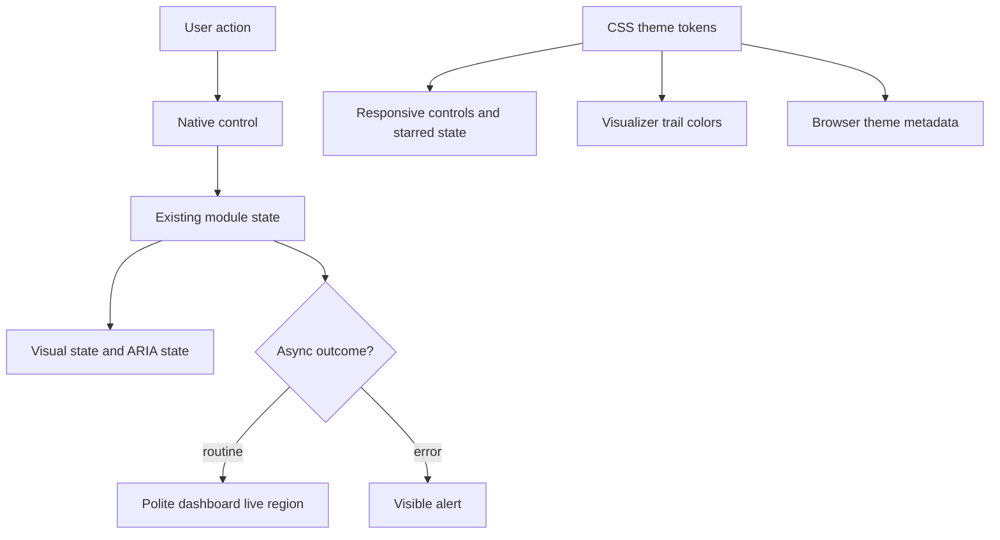

# Dashboard Audit Remediation - Plan

## Goal Capsule

- **Objective:** Raise the Impeccable audit score from 15/20 to at least 19/20 by closing every P1, P2, and P3 finding without redesigning the dashboard.
- **Authority:** The user's confirmed 19/20 scope overrides the older v1 deferral of broad mobile optimization; the scope remains limited to audit remediation.
- **Execution profile:** Extend the existing vanilla HTML, CSS, and JavaScript patterns with native semantics and no new dependencies.
- **Stop conditions:** Stop for direction if remediation requires a framework, a broad visual redesign, authentication or data changes, or a formal product-wide accessibility commitment beyond this audit pass.
- **Tail ownership:** Finish with the existing automated suite, rendered desktop/mobile verification, keyboard and reduced-motion checks, and a new dated Impeccable audit report.

---

## Product Contract

### Summary

Harden the existing purple-neon dashboard so every visible control has matching semantic behavior, mobile interactions are comfortably targetable, asynchronous results are announced, and CSS tokens remain the visual source of truth.
The dashboard layout, desktop density, rave identity, login video, and personal-tool product posture stay intact.

### Problem Frame

The current interface is visually coherent and responsive, but its interaction semantics trail its appearance.
Clickable filter spans cannot be reached by keyboard, symbol-only actions depend on `title`, selected modes are visual-only, transient feedback is not announced, and mobile controls inherit desktop target sizes.
Theme colors are mostly tokenized, but the starred state, canvas trails, and browser theme metadata bypass the token system.

### Requirements

**Interaction semantics**

- R1. Every clickable research or feed filter uses a native button, exposes its selected state through `aria-pressed`, and retains focus when selection re-renders its panel.
- R2. Every intensity-mode button exposes the initial and current mode through `aria-pressed` without changing mode behavior or audio gesture handling.
- R3. Every symbol-only player, feed, and task action has a stable accessible name that reflects its current action and preserves a useful focus position after a state-driven re-render.
- R4. Form controls encountered in the same player, research, and task flows have explicit accessible names instead of relying on placeholder text alone.

**Asynchronous feedback**

- R5. Loading, success, empty, and error outcomes remain visible and are announced with appropriate polite-status or alert semantics.
- R6. Announcements describe the completed action without duplicating persistent content or interrupting the user for routine updates.

**Responsive and theme hardening**

- R7. Interactive controls reach at least 44px in each target dimension at the mobile breakpoint while passive badges and the compact desktop layout remain unchanged.
- R8. Starred-state, canvas-trail, and browser theme colors derive from the CSS token system; the login video remains opacity-based, unblurred, and disabled for reduced motion.

**Verification**

- R9. Automated source-contract checks and rendered browser verification cover the remediated behaviors, and the follow-up audit scores at least 19/20 with no dimension regressing.

### Key Flows

- F1. **Keyboard selection:** The authenticated user tabs to a mode or filter, activates it with Enter or Space, sees the same visual result as a click, receives the new pressed state programmatically, and remains focused on the active control.
- F2. **Named action:** The user reaches an icon action and receives a precise name such as play, pause, star, unstar, add to notes, refresh, or delete before activating it.
- F3. **Async operation:** The user starts a load, save, copy, generation, or research action and receives a visible outcome plus a non-disruptive announcement.
- F4. **Mobile operation:** The user opens the dashboard at 390px width and can target controls without horizontal page overflow or accidental activation of adjacent controls.

### Acceptance Examples

- AE1. Given the All feed filter is active, when the user activates Starred by keyboard, then Starred becomes visually active, reports `aria-pressed="true"`, retains focus after refresh, and displays the filtered article list.
- AE2. Given Off is active, when the user activates Vibing, then Vibing reports pressed immediately and Off reports unpressed even if music loading later fails.
- AE3. Given an unstarred article, when assistive technology focuses the star button and the user activates it, then the action name changes from Star to Unstar after the saved state returns.
- AE4. Given a campaign copy or research-save request completes, when the visible feedback changes, then the dashboard's live region announces the outcome once.
- AE5. Given a 390x844 viewport, when interactive controls are measured, then each planned mobile target is at least 44x44px, passive badges stay compact, and the page has no horizontal overflow.
- AE6. Given reduced motion is enabled on the login page, when the page loads, then the festival video source remains unloaded and no video or blur effect is introduced by this work.

### Success Criteria

- The follow-up audit reaches at least 19/20: Accessibility 4/4, Responsive Design 4/4, Theming 4/4, Performance at least 3/4, and Anti-Patterns 4/4.
- All named keyboard flows work with Tab, Shift+Tab, Enter, and Space.
- No desktop control-density regression is visible at 1280x720, and no horizontal overflow appears at 390x844.
- `npm test` remains green with the new UI contract coverage included.

### Scope Boundaries

**In scope**

- Every finding recorded in `docs/audits/2026-07-12-impeccable-audit.md`.
- Obvious missing names on controls in the same affected flows, including volume, search, research question, task entry, and task completion.
- A separate dated audit artifact that records the new score rather than rewriting the original audit.

**Deferred to follow-up work**

- A browser automation or jsdom test harness; the app remains small enough for source-contract tests plus rendered acceptance checks.
- Broad mobile layout redesign, offline behavior, localization, multi-user roles, and any unrelated residual-review finding.
- A formal accessibility commitment in `PRODUCT.md`; this pass improves the personal tool without changing its product-governance statement.

---

## Planning Contract

### Key Technical Decisions

- KTD1. **Use native buttons for interactive pills.** Replace clickable spans rather than adding roles and key handlers, while keeping passive `.pill.badge` elements non-interactive.
- KTD2. **Represent selection with string ARIA values.** The shared `el()` helper drops boolean `false`, so dynamic controls must set `aria-pressed` as the strings `"true"` and `"false"`.
- KTD3. **Keep feedback visible and separate announcement channels.** Use visible `role="status"` content for persistent loading and empty states, visible `role="alert"` content for errors, and one dashboard announcer only for transient completions; never send the same message through two channels.
- KTD4. **Apply 44px targets only at the mobile breakpoint.** Reset button-pill styling and enlarge interactive controls under the existing 720px media query so desktop density and passive badges do not change.
- KTD5. **Make CSS the theme source.** Add semantic tokens for starred state and visualizer trails, read those tokens in JavaScript, and synchronize theme metadata from the background token while retaining the current static metadata as a fallback.
- KTD6. **Keep the video performance posture unchanged.** Do not add blur, nested backdrop effects, autoplay fallbacks, or new media; preserve reduced-motion source suppression.
- KTD7. **Test contracts without adding a DOM dependency.** Add one `node:test` source-contract file for durable semantic, mobile-target, and token invariants, then prove runtime state changes in the browser matrix.
- KTD8. **Preserve the baseline audit.** Write a new audit report after implementation so the 15/20 baseline remains traceable.
- KTD9. **Restore focus after destructive renders.** Give re-rendered stateful controls stable keys and restore focus to the equivalent surviving control, or the nearest useful neighbor when the original action removes itself.

### High-Level Technical Design

### Sequencing

1. Establish native control semantics and names before responsive styling so the CSS targets the final element types.
2. Add status and alert behavior after control markup stabilizes so announcements describe the final actions.
3. Centralize color and mobile sizing, then run the complete rendered verification matrix.
4. Re-run Impeccable last and record the new score in a separate audit.

### Risks and Mitigations

- **Native button styling changes pill geometry:** Reset `button.pill` appearance explicitly and compare desktop screenshots before accepting the change.
- **Live regions become noisy:** Announce only state transitions that complete or fail an action; do not read full article, campaign, or research content into the live region.
- **Mobile sizing causes wrapping:** Scope target enlargement to interactive controls and verify the mode bar, filter rows, campaign actions, and task rows at 390px.
- **Dynamic theme metadata has uneven browser support:** Keep the existing hexadecimal metadata as a fallback and treat CSS-token synchronization as progressive enhancement.
- **Source-contract tests become brittle:** Assert user-facing contracts and required selectors, not line numbers or full source snippets; runtime behavior remains a browser acceptance gate.

### Sources and Research

- `docs/audits/2026-07-12-impeccable-audit.md` defines the baseline score and remediation findings.
- `PRODUCT.md` preserves the energetic personal-dashboard identity and limits the accessibility commitment.
- `docs/residual-review-findings/2026-07-12-edmissions-v1.md` records the deliberate absence of a browser/jsdom harness.
- `public/css/app.css` already supplies the OKLCH token system, mobile breakpoint, reduced-motion behavior, and compact desktop control scale.
- `public/js/app.js` supplies the shared DOM helper and is the narrowest home for a cross-panel live announcer.

---

## Implementation Units

### U1. Replace visual-only interaction semantics

- **Goal:** Make filters, mode selection, and symbol controls keyboard- and assistive-technology-operable without changing their behavior.
- **Requirements:** R1, R2, R3, R4; F1, F2; AE1, AE2, AE3.
- **Dependencies:** None.
- **Files:** `public/index.html`, `public/js/notes.js`, `public/js/feed.js`, `public/js/player.js`, `public/js/tasks.js`, `public/css/app.css`, `test/ui-accessibility.test.js`.
- **Approach:** Convert only interactive pills to `button type="button"`; add string `aria-pressed` values to exclusive and toggle controls; synchronize mode state inside the existing `setMode()` loop; add dynamic labels to play/pause and star/unstar; label the volume, search, research, task-entry, and task-completion controls; restore focus to the equivalent keyed control after filters, tag toggles, stars, playback, and task actions re-render a panel.
- **Patterns to follow:** Reuse `el()` and the current state-driven full render; keep remote content in `textContent`; retain passive pills as spans.
- **Test scenarios:**
  - Covers F1 / AE1. Assert feed and note filters are button controls with false/true pressed states and no clickable span implementation remains.
  - Covers F1 / AE2. Assert all static mode buttons declare an initial pressed state and the mode update path writes both true and false string values.
  - Covers F2 / AE3. Assert symbol-only actions expose explicit labels, including the state-dependent play/pause and star/unstar names.
  - Assert the same affected flows give explicit names to range, search, research, task-entry, and checkbox controls.
  - Assert re-rendered controls expose stable focus keys for the browser acceptance pass.
- **Verification:** Keyboard activation produces the same list, mode, star, note, and task behavior as pointer activation, with current state visible in the accessibility tree and focus retained on an equivalent surviving control.

### U2. Announce asynchronous outcomes

- **Goal:** Make loading, completion, and failure feedback perceivable without replacing visible status text.
- **Requirements:** R5, R6; F3; AE4.
- **Dependencies:** U1.
- **Files:** `public/index.html`, `public/login.html`, `public/js/app.js`, `public/js/notes.js`, `public/js/feed.js`, `public/js/campaigns.js`, `public/css/app.css`, `test/ui-accessibility.test.js`.
- **Approach:** Add one visually hidden, atomic polite live region to the dashboard shell and a minimal shared announcer; mark login and in-panel visible errors as alerts; use visible status semantics for persistent loading and empty states; reserve the shared announcer for transient note, research, campaign, copy, and feed-refresh completions so no outcome is announced twice.
- **Patterns to follow:** Keep module-local state and error rendering; use the shared helper only for cross-panel announcement mechanics.
- **Test scenarios:**
  - Covers F3 / AE4. Assert the shell owns one polite atomic region and the shared announcer writes plain text to it.
  - Assert login and panel error surfaces expose alert semantics while routine loading surfaces remain polite.
  - Assert successful save, copy, generation, refresh, and research transitions call the announcer with concise messages rather than content bodies.
  - Assert a failed request leaves a visible error and does not replace it with success text.
- **Verification:** Browser inspection shows one announcement per completed or failed action, visible messages remain readable, and routine loading never steals focus.

### U3. Harden mobile targets and theme ownership

- **Goal:** Close the responsive and theming findings while preserving desktop density and the current performance posture.
- **Requirements:** R7, R8; F4; AE5, AE6.
- **Dependencies:** U1, U2.
- **Files:** `public/css/app.css`, `public/index.html`, `public/login.html`, `public/js/app.js`, `public/js/feed.js`, `public/js/visualizer.js`, `test/ui-accessibility.test.js`.
- **Approach:** Add semantic starred and visualizer-trail tokens; replace inline starred color and canvas base fills with token reads; synchronize browser theme metadata from the background token; add a visually hidden utility; set 44px mobile dimensions for interactive buttons, pills, fields, and range controls while exempting passive badges; preserve video opacity, bounded panel/header blur, and reduced-motion source suppression.
- **Patterns to follow:** Extend the existing `:root`, 720px, hover-capability, and reduced-motion blocks rather than adding a second responsive system.
- **Test scenarios:**
  - Covers F4 / AE5. Assert mobile interactive selectors carry a 44px minimum and passive badges are excluded.
  - Assert the starred state and three canvas trail fills resolve through CSS custom properties with no remaining hard-coded starred hex value or base trail RGB literal.
  - Assert both pages retain theme-color fallbacks and synchronize from the CSS background token.
  - Covers AE6. Assert reduced motion still suppresses the login video and no blur/filter is applied to the video element.
- **Verification:** At 1280x720 the layout and density match the baseline; at 390x844 targets measure at least 44x44px, filter/mode rows remain usable, and the document has no horizontal overflow.

### U4. Re-audit the completed surface

- **Goal:** Prove the score increase and preserve the result as a new point-in-time report.
- **Requirements:** R9; all acceptance examples.
- **Dependencies:** U1, U2, U3.
- **Files:** `docs/audits/2026-07-13-impeccable-audit.md`.
- **Approach:** Run the same technical and rendered checks used for the baseline at desktop and 390x844, include keyboard and reduced-motion verification, score every audit dimension, and record any residual finding without rewriting the baseline report.
- **Patterns to follow:** Mirror the headings, score table, severity model, and evidence style in `docs/audits/2026-07-12-impeccable-audit.md`.
- **Test expectation:** None - this unit records the results of automated and rendered checks completed by U1-U3.
- **Verification:** The new report records at least 19/20 with Accessibility, Responsive Design, Theming, and Anti-Patterns at 4/4 and Performance at 3/4 or better.

---

## Verification Contract

| Gate | Applies to | Done signal |
|---|---|---|
| `npm test` | U1-U3 | Existing tests and `test/ui-accessibility.test.js` pass with no live network dependency. |
| `git diff --check` | U1-U4 | No whitespace errors or unintended generated files. |
| Desktop browser at 1280x720 | U1-U3 | No visual-density regression, controls retain focus visibility, and no console errors appear. |
| Mobile browser at 390x844 | U1-U3 | Planned controls measure at least 44x44px, filter and mode rows remain usable, and horizontal overflow is absent. |
| Keyboard-only browser pass | U1-U2 | Every affected control is reachable and operable with Tab, Shift+Tab, Enter, and Space; pressed states update correctly. |
| Reduced-motion login pass | U3 | Festival video source remains unloaded and the fallback background/sign-in card remain usable. |
| `$impeccable audit` | U4 | A new dated report records at least 19/20 and no category regresses. |

---

## Definition of Done

- Every requirement R1-R9 and acceptance example AE1-AE6 is satisfied.
- Every P1, P2, and P3 item from the baseline audit is either fixed or explicitly carried as a scored residual in the new audit.
- The dashboard preserves its purple-neon identity, panel layout, desktop density, login video treatment, and personal-tool scope.
- No frontend framework, accessibility library, DOM test dependency, or alternate responsive system is added.
- Automated tests, desktop/mobile browser checks, keyboard verification, reduced-motion verification, and the follow-up audit all pass.
- The final diff contains no abandoned experiments, duplicate status mechanisms, or unrelated cleanup.
