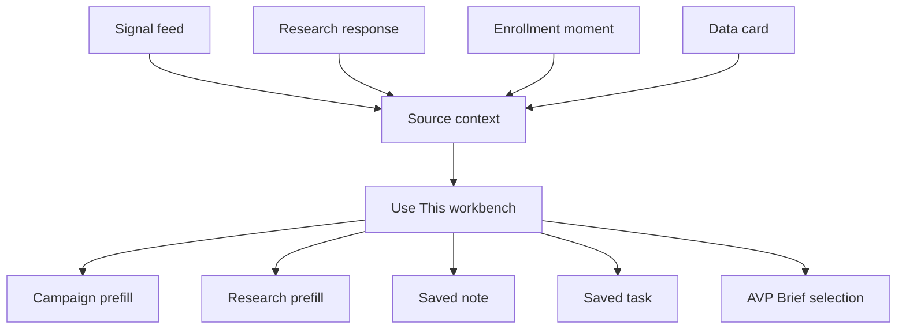
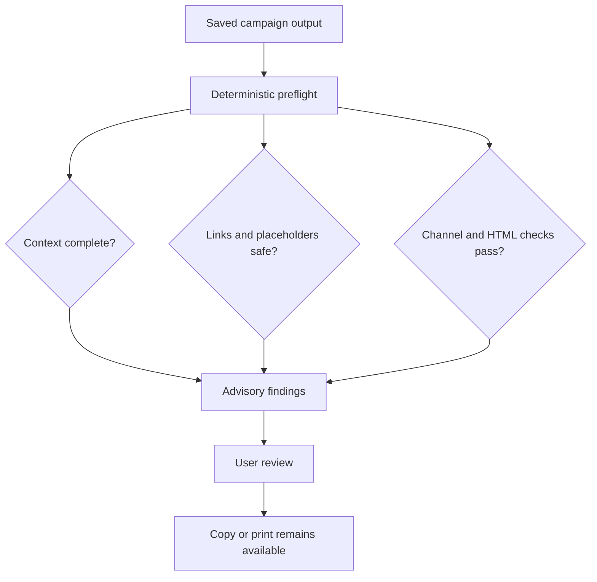
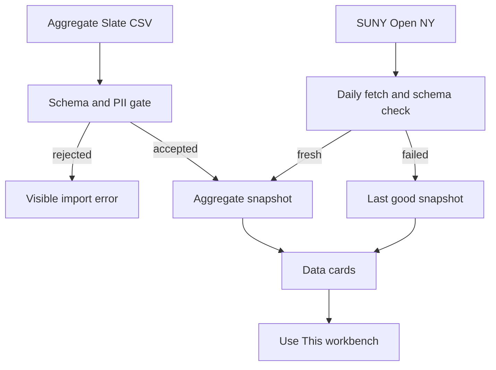

# EDMissions Workflow Tools - Plan

## Goal Capsule

- **Objective:** Connect campaign quality checks, current signals, reusable audiences, enrollment timing, AVP briefing, and aggregate enrollment data into one coherent SUNY Delhi workflow.
- **Authority:** The confirmed scope and decisions in this plan govern implementation; `BACKLOG.md` remains the feature inventory and `PRODUCT.md` governs the personal-dashboard identity.
- **Execution profile:** Extend the existing Express, SQLite, vanilla JavaScript, and CSS patterns with native platform features and the currently installed dependencies.
- **Stop conditions:** Stop for direction if a phase requires student-level records, direct Slate credentials, a new external account, automated publishing or email, a frontend framework, or a material redesign of the dashboard.
- **Tail ownership:** Each phase receives its own automated and rendered verification, then lands independently before the next phase begins.

---

## Product Contract

### Summary

Add six connected capabilities to the existing dashboard: Campaign Preflight, source-aware Signals with a “Use This” workbench, Audience Lanes, Enrollment Moments, an on-demand AVP Brief, and an aggregate-only Data Command Center.
The build preserves Research Hub and Campaign Studio as the dominant workspace while secondary tools reuse the same source context, records, and authenticated API.

### Problem Frame

EDMissions already captures news, research, notes, campaigns, and tasks, but most useful information stops inside the panel where it was found.
Campaign output has no final quality check, the feed does not distinguish local and system relevance, audience knowledge is rebuilt for each campaign, and important enrollment dates do not drive work.
The dashboard also cannot assemble a briefing or combine aggregate Slate counts with public enrollment evidence.

The solution should close those workflow gaps without becoming a CRM, a scheduling system, or a general-purpose analytics platform.
The application remains a focused personal tool for AVP Nazely.

### Actors

- A1. **AVP Nazely:** Reviews signals, researches questions, drafts campaigns, plans enrollment work, and interprets aggregate data.
- A2. **Public source:** Supplies published news, dates, enrollment data, or labor-market context with a source URL and date.
- A3. **Slate aggregate export:** Supplies counts grouped by approved funnel dimensions without student-level records.

### Requirements

#### Campaign quality

- R1. A generated text or HTML campaign exposes an advisory preflight before copy or print.
- R2. Preflight checks required campaign context, CTA and links, placeholders, source support, deadline consistency, likely repetition, channel length, and basic HTML accessibility.
- R3. Preflight explains each warning and never blocks copy, print, or deletion.
- R4. Campaign records retain audience, sender, channel, deadline, and attached source context so preflight and later briefs use the same facts.

#### Signals and workbench

- R5. Every supported signal or research response can open one “Use This” workbench with actions for Campaign, Research, Notes, Tasks, and AVP Brief.
- R6. Every handoff preserves available title, publisher, publication date, URL, excerpt, and source lane.
- R7. The feed supports SUNY Delhi, local and regional, SUNY system, and national higher-education lanes.
- R8. Recent enrollment signals rank first only when published within seven days; other results rank by source lane and publication date.
- R9. Job-posting headlines remain excluded unless the title contains both Enrollment and a VP variation.
- R10. One unavailable feed does not block other sources, and the interface identifies the failed source without discarding the last stored items.

#### Audience and timing

- R11. Campaign Studio offers seeded Audience Lanes for prospective students, families, counselors, adult learners, accepted students, deposited students, current students, and campus partners.
- R12. A selected lane adds editable priorities, tone, proof guidance, and CTA guidance without overwriting manually edited campaign copy.
- R13. Enrollment Moments seed only exact dates published by SUNY Delhi, retain source and verification dates, and remain editable.
- R14. Each moment carries an audience, lead time, suggested channels, and optional notes.
- R15. A moment can start a sourced campaign or task without an external calendar integration.

#### Briefing

- R16. The AVP Brief is generated on demand and previews recent selected signals, research, campaign work, enrollment moments, tasks, decisions, and available aggregate indicators.
- R17. Brief content retains source links and supports removal, copy, and browser printing without an email or document-publishing workflow.

#### Data Command Center

- R18. The Data Command Center accepts public aggregate data and an aggregate Slate CSV, and it never accepts or stores student-level records.
- R19. Slate uploads validate the approved schema, reject likely PII columns, reject invalid or negative counts, and retain source and as-of metadata.
- R20. The first public-data connector shows SUNY Delhi enrollment trends from SUNY Open NY and retains the last good snapshot when the source is unavailable.
- R21. Public-source cards link to official SUNY, IPEDS, College Scorecard, and New York Department of Labor resources even when a source is not yet ingested.
- R22. Data cards can enter the same “Use This” workbench and retain dataset, measure, geography, as-of date, and official source URL.

#### Product and trust boundaries

- R23. Research Hub and Campaign Studio remain the prominent default tabs; Moments, AVP Brief, and Data appear as secondary workspace tools.
- R24. New persistent user actions use authenticated APIs and durable records so the UI and AI-assisted workflows operate on the same context; unopened workbench state and unsaved prefills may remain in memory.
- R25. No feature sends, publishes, schedules, or modifies an external system without a separate future approval.

### Key Decisions

- **Aggregate-only data boundary.** (session-settled: user-directed — chosen over public-only or row-level Slate data: public context and aggregate funnel counts provide value without importing student records.) Governs R18-R22.
- **Official editable enrollment dates.** (session-settled: user-directed — chosen over generic milestones or blank setup: current Delhi dates give immediate value while local edits preserve control.) Governs R13-R15.
- **Curated source policy.** (session-settled: user-directed — chosen over official-only or broad web matching: official sources plus a small local allowlist balance relevance and noise.) Governs R7-R10.
- **On-demand AVP Brief.** (session-settled: user-approved — chosen over scheduled or emailed delivery: preview, copy, and print fit the personal dashboard without external automation.) Governs R16-R17.

### Key Flows

- F1. **Preflight and copy:** A1 opens generated campaign output, reviews advisory findings, corrects or accepts them, and copies or prints the output.
- F2. **Signal to action:** A1 opens “Use This” on a signal, selects a destination, and arrives with source context prefilled or saved.
- F3. **Audience-aware campaign:** A1 selects a lane, adds optional audience notes, generates a campaign, and later changes lanes without losing manual campaign fields.
- F4. **Moment to work:** A1 reviews an upcoming verified moment, edits it if needed, and starts a campaign or task with the date and source attached.
- F5. **Brief preparation:** A1 adds selected material to the brief, previews the assembled result, removes noise, then copies or prints it.
- F6. **Aggregate data review:** A1 uploads an approved Slate summary or refreshes public SUNY data, reviews the dated snapshot, and sends a selected finding into Research, Campaign, Notes, Tasks, or the AVP Brief.

### Acceptance Examples

- AE1. Given a generated campaign with no audience or deadline, when A1 opens its preflight, then both omissions appear as advisory warnings and Copy remains available.
- AE2. Given an HTML template with an image lacking alternate text and an empty link, when preflight runs, then it identifies both accessibility concerns without altering the HTML.
- AE3. Given a SUNY Delhi article, when A1 chooses “Use This” then “Start campaign,” then Campaign Studio opens with the title, excerpt, source URL, and publisher available as editable context.
- AE4. Given a recent national enrollment article and a newer general national article, when the enrollment article is eight days old, then it no longer receives the recent-enrollment priority.
- AE5. Given one source fails during polling, when other sources succeed, then fresh items from successful sources appear and the failed source is reported.
- AE6. Given A1 edited the campaign purpose, when a different Audience Lane is selected, then the purpose remains unchanged and only lane guidance changes.
- AE7. Given the seeded Fall 2026 billing deadline, when A1 edits its lead time and saves, then the edit persists across restart and the official source remains attached.
- AE8. Given selected signals, an open task, and an approaching moment, when A1 opens the AVP Brief, then the preview includes those items with links and prints without dashboard chrome.
- AE9. Given a CSV containing `email` or `student_id`, when A1 attempts an upload, then the import is rejected and no snapshot is stored.
- AE10. Given a valid aggregate CSV with counts by term and stage, when A1 uploads it, then the Data Command Center stores one dated snapshot and renders funnel totals without preserving a raw student file.
- AE11. Given SUNY Open NY is unavailable after one successful refresh, when A1 opens Data, then the last good snapshot remains visible with its as-of and stale status.
- AE12. Given a data card, when A1 adds it to the AVP Brief, then the brief retains the metric, geography, period, dataset name, and official source URL.

### Success Criteria

- Each supported source can reach every supported workbench destination without retyping its core context.
- Campaign copy remains available while actionable preflight guidance is visible.
- Seeded audience and moment context improves campaigns without overwriting manual fields.
- The AVP Brief can be assembled, copied, and printed from dashboard records.
- A valid aggregate Slate export and the SUNY enrollment source produce useful cards; likely PII inputs are rejected before storage.
- `npm test` remains network-independent and passes after every phase.

### Scope Boundaries

#### In scope

- Every accepted item in `BACKLOG.md`.
- The first Data Command Center pilot: aggregate Slate funnel snapshots, SUNY Open NY enrollment trends, and official source links.
- Official Fall 2026 and Spring 2027 Delhi dates that have an exact published date during implementation.
- The Reporter and The Daily Star as the initial local-publisher allowlist, plus Delaware County official releases.

#### Deferred to follow-up work

- Automated NY Department of Labor, IPEDS, College Scorecard, GradWages, and Census ingestion beyond official source cards.
- Program-to-occupation mapping, peer benchmarking, geospatial recruitment maps, and multi-snapshot forecasting.
- A direct Slate API, scheduled file transfer, or automatic CSV pickup.
- Feed-source management in the UI, saved brief snapshots, PDF generation, and calendar synchronization.
- Optional AI tone review after deterministic preflight proves insufficient.

#### Outside this product's identity

- Student-level CRM records, outreach automation, campaign sending, lead scoring, or applicant decisions.
- Team permissions, approval routing, scheduled email, shared dashboards, or enterprise BI administration.
- The Event Follow-up Kit.

---

## Planning Contract

### Key Technical Decisions

- KTD1. **Use additive SQLite changes.** New tables use `CREATE TABLE IF NOT EXISTS`; new columns follow the existing `PRAGMA table_info` migration pattern so deployed personal data remains intact.
- KTD2. **Carry one source context through the browser.** A small shared workbench module normalizes existing records into source context and dispatches destination actions; destination modules remain responsible for their own state and API calls.
- KTD3. **Persist only durable selections.** Notes, tasks, campaigns, moments, data snapshots, and AVP Brief selections live in SQLite; an unopened workbench and temporary prefill state remain in memory.
- KTD4. **Keep preflight deterministic and advisory.** Reliable field, link, placeholder, length, repetition, date, and HTML checks run without a second AI call; uncertain claims receive a review warning rather than a factual verdict.
- KTD5. **Rank by explicit source lane.** Stored articles carry a lane copied from feed configuration; when two sources find the same link, the higher-priority lane may upgrade its provenance without replacing the article or star state. Feed ordering applies the seven-day enrollment gate, then lane priority, then publication date.
- KTD6. **Use RSS-compatible sources only in the first signal phase.** Native RSS is preferred; site-restricted Google News RSS is the fallback for allowlisted publishers without a stable feed.
- KTD7. **Keep Audience Lanes in content configuration.** Campaign Studio resolves seeded lane guidance from `config/content.json` and stores only the selected lane plus custom audience notes with the campaign.
- KTD8. **Seed moments once and preserve edits.** Config supplies official moment seeds with source metadata; existing database rows are never silently refreshed or overwritten.
- KTD9. **Compose the brief from current records.** The server returns one deterministic Markdown-shaped brief model, while the browser supplies preview, removal, clipboard, and print behavior.
- KTD10. **Store aggregate snapshots as validated JSON.** A snapshot table keeps normalized aggregate rows and metadata without retaining the uploaded CSV or creating a general analytics schema.
- KTD11. **Use one cached public connector first.** The server uses native `fetch` for the SUNY Open NY dataset at most once per day and serves the last good snapshot on timeout, throttling, or schema failure.
- KTD12. **Keep secondary tools in the central workspace.** Research and Campaign retain prominent tabs; Moments, Brief, and Data use compact utility tabs and the same panel area instead of adding another dashboard column.
- KTD13. **Preserve API and context parity.** Each new primary action has an authenticated route, and AI-assisted destinations receive the same attached source context visible in the UI; no AI path gains an autonomous external-write capability.
- KTD14. **Land one phase at a time.** (session-settled: user-directed — chosen over local-only or bundled delivery: separate remote phase checkpoints make review and rollback straightforward.)

### High-Level Technical Design

#### Shared workbench flow

#### Campaign preflight flow

#### Data trust boundary

### Phased Delivery

1. **Phase 1 — Campaign confidence:** U1 adds advisory preflight and the campaign context it needs.
2. **Phase 2 — Signals into action:** U2 adds the shared workbench and U3 adds source lanes, curated feeds, and ranked signal browsing.
3. **Phase 3 — Audience discipline:** U4 adds reusable Audience Lanes to campaign context.
4. **Phase 4 — Enrollment timing:** U5 adds verified, editable Enrollment Moments and handoffs.
5. **Phase 5 — AVP synthesis:** U6 assembles the on-demand brief from current dashboard work.
6. **Phase 6 — Data pilot:** U7 adds aggregate Slate snapshots and U8 adds the first public data connector and official data-source catalog.

### Risks and Dependencies

- **External source drift:** RSS endpoints, Google News result shapes, public dataset columns, and Delhi dates can change. Isolate each source failure, validate shapes, and keep last good data.
- **False-positive preflight warnings:** Advisory wording and non-blocking controls prevent a heuristic from stopping useful work.
- **Context duplication:** One normalized workbench context owns handoff fields; destinations add only their local fields.
- **SQLite migration safety:** Additive migrations and temporary-database tests protect the existing mounted database.
- **CSV privacy:** Header and schema rejection happens before snapshot insertion, and raw CSV content is not retained or logged.
- **CSV size and parser limits:** Cap uploads at the existing request limit, accept one documented aggregate schema, and reject malformed quoting or unexpected columns.
- **Dashboard crowding:** Secondary utility tabs reuse the central pane; no new permanent column competes with Research or Campaign.
- **Print leakage:** Print styles hide navigation, player, workbench controls, and unrelated panels.
- **Public-data rate limits:** One daily read and last-good caching avoid turning the personal dashboard into a polling client; an application token remains deferred unless throttling is observed.

### System-Wide Impact

- **Data lifecycle:** Additive migrations preserve the mounted SQLite database. Moment seeds run only against an empty moments table, aggregate imports commit as one transaction, Brief selections never own their source records, and the server stores no raw CSV.
- **Authentication and trust boundaries:** Existing authentication middleware covers every new API route. Browser-provided URLs, HTML, CSV text, and public API responses are validated before storage or rendering; no request body is logged.
- **Shared context and AI:** The workbench source context is the single browser handoff shape. Campaign AI receives selected audience, moment, and source facts through existing server-owned prompt assembly, while deterministic preflight, briefs, feeds, and data cards make no AI request.
- **Failure propagation:** A failed destination action leaves the workbench retryable, a failed feed or public-data source leaves stored records intact, and a failed aggregate import inserts no partial snapshot.
- **Caching and freshness:** Feed records remain durable, public data refreshes at most daily with a visible stale fallback, and moment verification dates remain visible without silent source-driven overwrites.
- **Interface parity:** The same authenticated domain routes back both direct UI actions and AI-assisted campaign context. Workspace changes preserve focus and announcements, and print styles suppress unrelated dashboard chrome.
- **Performance posture:** Personal-tool volume, bounded feed lists, the existing one-megabyte JSON limit, and daily public-data refreshes avoid new queues, cache infrastructure, chart libraries, or background workers.

### Sources and Research

- `BACKLOG.md` records accepted, deferred, and rejected product ideas.
- `PRODUCT.md` requires a coherent personal command center rather than enterprise software.
- `server/db.js` establishes the additive SQLite and mounted-data pattern.
- `server/poller.js` and `server/routes/feed.js` establish failure isolation, excerpt-only storage, title filtering, and recent enrollment ranking.
- `public/js/notes.js` establishes cross-panel custom events and source-aware note capture.
- `public/js/app.js` establishes authenticated fetch, safe DOM construction, live announcements, and workspace navigation.
- [SUNY Delhi Academic Calendar](https://www.delhi.edu/academic-calendar/index.php) publishes term calendars and marks exact deadlines as subject to change.
- [SUNY Delhi Student Financial Services dates](https://www.delhi.edu/admission/financial-aid/deadlines/) publishes the Fall 2026 billing deadline, FAFSA availability, and other enrollment moments.
- [SUNY Delhi Newsroom](https://www.delhi.edu/marcomm/newsroom.php) is the official campus news hub.
- [SUNY News](https://www.suny.edu/suny-news/) publishes current system news and exposes an RSS option.
- [Delaware County local-news directory](https://www.delcony.gov/liveworkplay/residents/) lists The Daily Star and The Reporter among local sources.
- [Delaware County press releases](https://www.delcony.gov/blog/category/pressrelease/) provide an official regional source with a working RSS feed.
- [Slate integrations](https://technolutions.com/integrations) confirms that scheduled web services, batched file transfers, and APIs are available for a later approved integration.
- [SUNY institutional research resources](https://system.suny.edu/institutional-research/resources/) links Fast Facts, campus fact sheets, GradWages, transfer flows, and SUNY Open NY.
- [IPEDS Use the Data](https://nces.ed.gov/ipeds/use-the-data) provides institutional comparison and downloadable aggregate CSV data.
- [New York employment projections](https://dol.ny.gov/employment-projections) provides statewide and regional projections, annual openings, wages, and education requirements.
- [Socrata API endpoints](https://dev.socrata.com/docs/endpoints) documents dataset endpoints, version behavior, and application-token requirements.

---

## Implementation Units

### U1. Add advisory Campaign Preflight

- **Phase:** 1 — Campaign confidence.
- **Goal:** Show deterministic quality findings on saved campaign output before copy or print.
- **Requirements:** R1-R4; F1; AE1-AE2; KTD1, KTD4.
- **Dependencies:** None.
- **Files:** `server/db.js`, `server/routes/campaigns.js`, `server/routes/ai.js`, `public/js/campaigns.js`, `public/css/app.css`, `test/campaigns.test.js`, `test/ui-accessibility.test.js`.
- **Approach:**
  1. Add optional audience, sender, channel, deadline, and source-context fields to campaign validation and persistence without changing the existing required fields.
  2. Add a pure deterministic preflight projection for a stored campaign and expose it through the authenticated campaign API.
  3. Render findings beside campaign output with severity, explanation, and an explicit advisory label.
  4. Keep copy and delete actions available for every preflight state; use browser printing only for HTML output where useful.
- **Execution note:** Start with route-level tests for the warning contract before adding the output panel.
- **Patterns to follow:** Reuse the additive migration checks in `server/db.js`, the route validation style in `server/routes/campaigns.js`, and state-driven rendering in `public/js/campaigns.js`.
- **Test scenarios:**
  - Covers AE1. Create a campaign without audience and deadline, request preflight, and assert both warnings appear while the campaign remains retrievable.
  - Create a complete text campaign with CTA text, the exact CTA URL, sender, channel, audience, and deadline, then assert no missing-context warning appears.
  - Create an output containing an unresolved `{{placeholder}}`, then assert preflight identifies it.
  - Create output with a deadline field whose formatted date is absent, then assert a date-consistency warning appears.
  - Covers AE2. Create HTML with one image lacking alternate text and one empty anchor, then assert both checks appear and the stored HTML is unchanged.
  - Create a campaign with repeated near-identical messages, then assert repetition is advisory rather than an API failure.
  - Assert the campaign view labels the preflight region and retains an enabled copy control when warnings exist.
- **Verification:** Existing text, HTML, and brief generation still work; stored campaign context round-trips; known warning fixtures produce stable advisory results.

### U2. Establish the shared “Use This” workbench

- **Phase:** 2 — Signals into action.
- **Goal:** Route source context into Campaign, Research, Notes, Tasks, or AVP Brief through one reusable UI.
- **Requirements:** R5-R6, R24-R25; F2; AE3; KTD2, KTD3, KTD13.
- **Dependencies:** U1.
- **Files:** `server/db.js`, `server/index.js`, `server/routes/briefs.js`, `public/index.html`, `public/js/app.js`, `public/js/workbench.js`, `public/js/feed.js`, `public/js/notes.js`, `public/js/campaigns.js`, `public/js/tasks.js`, `public/css/app.css`, `test/briefs.test.js`, `test/ui-accessibility.test.js`.
- **Approach:**
  1. Add a minimal AVP Brief selection table and authenticated create, list, and delete routes so “Add to AVP Brief” is durable before the full brief view exists.
  2. Normalize article and research-response fields into a source context in one browser module.
  3. Open an accessible workbench dialog or drawer with five explicit destination actions.
  4. Dispatch editable prefills to Research and Campaign; create Notes, Tasks, and Brief selections through their existing or new APIs.
  5. Expose a shared workspace-selection helper so a successful handoff opens the correct central pane and restores useful focus.
- **Patterns to follow:** Extend the existing `edm:add-to-note` event pattern, `api()` wrapper, safe `el()` helper, focus keys, and polite announcement channel.
- **Test scenarios:**
  - Covers AE3. Normalize an article and assert its Campaign handoff retains title, excerpt, publisher, date, URL, and lane.
  - Normalize a research response without a URL and assert destinations receive the question and answer without inventing provenance.
  - Add the same source to Notes, Tasks, and Brief, then assert each durable record contains the expected source label or URL.
  - Simulate a destination request failure and assert the workbench stays open with a visible error and retryable action.
  - Assert the workbench has an accessible name, closes with Escape, traps no focus after closing, and returns focus to its invoking control.
  - Assert every workbench API rejects an unauthenticated request through the existing auth layer.
- **Verification:** A feed article and a research response each reach all five destinations with their source trail intact and no autonomous external action.

### U3. Add curated source lanes and ranked signals

- **Phase:** 2 — Signals into action.
- **Goal:** Prioritize useful SUNY Delhi, regional, SUNY system, and national signals while keeping polling resilient.
- **Requirements:** R7-R10; F2; AE4-AE5; KTD1, KTD5, KTD6.
- **Dependencies:** U2.
- **Files:** `config/content.json`, `server/db.js`, `server/poller.js`, `server/routes/feed.js`, `public/js/feed.js`, `public/css/app.css`, `test/poller.test.js`, `test/scoring.test.js`, `test/config.test.js`, `test/ui-accessibility.test.js`.
- **Approach:**
  1. Add a source lane to feed configuration and stored articles, with existing rows defaulting to national.
  2. Configure campus, local, SUNY, and national sources using native RSS or site-restricted RSS fallbacks.
  3. On a duplicate link, retain the existing article and star state while allowing a newly discovered higher-priority source to upgrade its lane and source label.
  4. Update ordering to apply the seven-day enrollment gate before lane priority and date.
  5. Add lane filters and source-failure status without changing star behavior or the existing job-title rule.
  6. Add “Use This” beside the existing star and note actions.
- **Patterns to follow:** Preserve excerpt-only ingestion, safe HTTP links, per-source failure isolation, load identifiers, focus restoration, and source-text rendering through `textContent`.
- **Test scenarios:**
  - Poll one item per lane and assert each stored article retains its configured lane.
  - Covers AE4. Insert an eight-day-old enrollment article and a fresh general article, then assert the old enrollment item loses recent-enrollment priority.
  - Insert fresh local and national non-enrollment items with the same timestamp, then assert the local item ranks first.
  - Poll the same link first through a national source and then through a campus source, then assert one article remains, its lane upgrades to campus, and its star state is unchanged.
  - Covers AE5. Fail one source while three others return valid RSS, then assert successful items store and the failed source appears in poll status.
  - Assert a normal job headline is excluded while Enrollment plus VP variations remain accepted.
  - Filter each lane in the UI contract and assert pressed state and focus keys remain available.
- **Verification:** Fresh items from every configured lane appear with correct labels; relevance ordering matches R8; one dead source never prevents the other lanes from refreshing.

### U4. Add config-backed Audience Lanes

- **Phase:** 3 — Audience discipline.
- **Goal:** Reuse concise audience guidance in Campaign Studio without building segmentation infrastructure.
- **Requirements:** R11-R12; F3; AE6; KTD7.
- **Dependencies:** U1.
- **Files:** `config/content.json`, `server/routes/campaigns.js`, `server/routes/ai.js`, `public/js/campaigns.js`, `public/css/app.css`, `test/config.test.js`, `test/campaigns.test.js`, `test/openai.test.js`, `test/ui-accessibility.test.js`.
- **Approach:**
  1. Add the approved lane definitions to content configuration with priorities, tone, proof guidance, and CTA guidance.
  2. Resolve the selected lane on the server and include it in handoff briefs and AI generation alongside campus memory and source context.
  3. Add a lane selector, compact guidance preview, and editable custom audience notes to Campaign Studio.
  4. Persist the selected lane identifier and custom notes with each campaign while leaving purpose, CTA, URL, and generated output untouched on lane changes.
- **Patterns to follow:** Use `config/content.json` for seeded content, current labeled field helpers, and server-owned prompt assembly.
- **Test scenarios:**
  - Assert all approved lanes load through capabilities or the campaign configuration response.
  - Covers AE6. Edit purpose and CTA fields, switch lanes, and assert those fields remain unchanged while guidance changes.
  - Generate a handoff brief with the adult-learner lane and assert the lane guidance and custom notes appear exactly once.
  - Submit an unknown lane identifier and assert the request fails cleanly instead of accepting arbitrary prompt context.
  - Reload a stored campaign and assert its lane and custom notes remain visible.
- **Verification:** Every configured lane can drive a brief or AI campaign, manual campaign copy survives lane changes, and no prospect or audience-member records are created.

### U5. Add verified Enrollment Moments

- **Phase:** 4 — Enrollment timing.
- **Goal:** Turn official, editable Delhi dates into timely campaign and task starts.
- **Requirements:** R13-R15; F4; AE7; KTD1, KTD8, KTD12.
- **Dependencies:** U2, U4.
- **Files:** `config/content.json`, `server/db.js`, `server/index.js`, `server/routes/moments.js`, `public/index.html`, `public/js/app.js`, `public/js/moments.js`, `public/js/workbench.js`, `public/css/app.css`, `test/moments.test.js`, `test/config.test.js`, `test/ui-accessibility.test.js`.
- **Approach:**
  1. Seed exact current Delhi dates with source URL, verification date, audience, lead days, channels, and notes.
  2. Store moments in SQLite and record one-time seeding independently of row count so edits and deletions survive restart and config changes.
  3. Add a compact chronological workspace view with upcoming, past, add, edit, and delete states using native date and number inputs.
  4. Send a moment through the workbench to Campaign or Tasks with its date and official source attached.
  5. Mark stale verification dates for review without changing or deleting the saved moment.
- **Patterns to follow:** Mirror campaign campus seeding, route validation, simple list/editor state, focus restoration, and the shared workbench context.
- **Test scenarios:**
  - Seed a fresh database and assert only exact published Delhi dates are created with source and verification metadata.
  - Covers AE7. Edit lead days on the Fall 2026 billing deadline, rerun seeding, and assert the edit remains.
  - Delete every seeded moment, rerun initialization, and assert deleted rows do not reappear.
  - Create a moment with an invalid date or negative lead time and assert validation rejects it.
  - Send a moment to Campaign and assert its name, date, audience, and source prefill without overwriting an existing draft.
  - Send a moment to Tasks and assert the task contains the moment date and useful action text.
  - Assert upcoming moments sort by date and past moments remain available without dominating the default view.
- **Verification:** Seeded and user-created moments persist, verified source context stays visible, and Campaign/Task handoffs require no retyping.

### U6. Assemble the on-demand AVP Brief

- **Phase:** 5 — AVP synthesis.
- **Goal:** Preview, prune, copy, and print a concise brief from current dashboard work.
- **Requirements:** R16-R17; F5; AE8; KTD3, KTD9, KTD12.
- **Dependencies:** U2, U5.
- **Files:** `server/routes/briefs.js`, `public/index.html`, `public/js/app.js`, `public/js/brief.js`, `public/js/workbench.js`, `public/css/app.css`, `test/briefs.test.js`, `test/ui-accessibility.test.js`.
- **Approach:**
  1. Compose a deterministic brief model from durable Brief selections, open tasks, approaching moments, and recent campaign work.
  2. Keep selected sourced items removable without deleting their origin records.
  3. Render a readable preview with source links, copy the Markdown-shaped text, and use print-specific CSS for browser printing.
  4. Keep generation manual and show the brief’s assembly timestamp.
- **Patterns to follow:** Reuse existing list queries, clipboard feedback, safe link rendering, and the central workspace pane.
- **Test scenarios:**
  - Covers AE8. Add a signal selection, open task, and upcoming moment, then assert all appear in the assembled brief with expected source links.
  - Remove one Brief selection and assert the origin article or note remains intact.
  - Mark a task complete and assert it no longer appears in the open-task section.
  - Add an item without a URL and assert the brief renders it as plain text rather than an unsafe or empty link.
  - Assert the brief remains absent from background jobs and no route sends or emails it.
  - Assert print CSS hides player, navigation, workbench controls, and unrelated panels.
- **Verification:** A1 can build the brief from existing work, remove noise, copy it, and produce a clean browser print without retyping or external publishing.

### U7. Add aggregate Slate snapshot import

- **Phase:** 6 — Data pilot.
- **Goal:** Accept one documented aggregate funnel CSV and render useful totals without storing a raw file or student record.
- **Requirements:** R18-R19, R22, R24-R25; F6; AE9-AE10, AE12; KTD1, KTD10, KTD12, KTD13.
- **Dependencies:** U2, U6.
- **Files:** `server/db.js`, `server/index.js`, `server/routes/data.js`, `public/index.html`, `public/js/app.js`, `public/js/data.js`, `public/js/workbench.js`, `public/css/app.css`, `test/data.test.js`, `test/ui-accessibility.test.js`, `README.md`.
- **Approach:**
  1. Accept browser-read CSV text through a size-limited authenticated route rather than adding multipart middleware.
  2. Parse one documented aggregate schema for term, stage, program, residency, geography, source, count, prior-year count, and goal.
  3. Reject PII-like headers, unexpected columns, malformed rows, invalid dates, non-numeric counts, and negative values before database insertion.
  4. Store normalized aggregate rows and metadata in one dated snapshot; discard raw CSV content after validation.
  5. Render funnel totals and simple comparisons with native HTML and CSS, then expose each card through the workbench.
- **Execution note:** Add failing privacy-boundary and malformed-CSV tests before the successful import path.
- **Patterns to follow:** Keep input limits at the route boundary, use SQLite transactions for one snapshot, avoid logging request bodies, and build DOM with `textContent`.
- **Test scenarios:**
  - Covers AE9. Upload a CSV with `email`, `student_id`, `name`, or `birth_date`, then assert a 400 response and zero stored snapshots.
  - Covers AE10. Upload valid aggregate rows across two funnel stages, then assert one snapshot stores normalized rows and correct totals.
  - Upload quoted fields containing commas and assert they parse correctly.
  - Upload malformed quoting, an extra header, a negative count, and a non-numeric count, then assert each request fails without partial storage.
  - Upload a file above the allowed size and assert it is rejected before parsing.
  - Covers AE12. Send a funnel card to the AVP Brief and assert its measure, term, dimensions, as-of date, and source label remain attached.
  - Assert no database column or response returns raw CSV content.
- **Verification:** The documented aggregate export imports transactionally, forbidden inputs leave no trace, and stored cards can move through every workbench destination.

### U8. Add SUNY public data and the official source catalog

- **Phase:** 6 — Data pilot.
- **Goal:** Add a resilient SUNY Delhi enrollment trend and orient future analysis toward official outcomes and labor sources.
- **Requirements:** R20-R22, R24-R25; F6; AE11-AE12; KTD3, KTD11, KTD13.
- **Dependencies:** U7.
- **Files:** `config/content.json`, `server/config.js`, `server/routes/data.js`, `public/js/data.js`, `public/js/workbench.js`, `public/css/app.css`, `test/config.test.js`, `test/data.test.js`, `README.md`.
- **Approach:**
  1. Fetch the SUNY Open NY enrollment dataset through its read-only Socrata endpoint and select SUNY Delhi rows needed for a compact trend.
  2. Validate required dataset columns before replacing the last good snapshot and limit refreshes to one per day.
  3. Show freshness, source, period, measure definitions, and stale fallback status on each public-data card.
  4. Add official source cards for SUNY institutional research, IPEDS, College Scorecard, NY Department of Labor projections and wages, BLS, and Census.
  5. Route enrollment trend cards through the same workbench; source cards remain outbound references until a later validated question justifies ingestion.
- **Patterns to follow:** Reuse poller timeouts and per-source failure isolation, store excerpts or aggregates rather than full source content, and keep all outbound URLs allowlisted in config.
- **Test scenarios:**
  - Fetch a valid SUNY response and assert only SUNY Delhi trend rows enter the public snapshot.
  - Return a response missing one required column and assert the last good snapshot remains unchanged.
  - Covers AE11. Timeout after a successful refresh and assert the API serves the stored snapshot with stale status and original as-of date.
  - Request a second refresh inside one day and assert no second external fetch occurs.
  - Render every official source card with an HTTPS URL and safe external-link attributes.
  - Covers AE12. Add an enrollment trend card to the AVP Brief and assert dataset, measure, year, institution, as-of date, and official URL remain attached.
- **Verification:** The Data workspace remains useful during source failure, makes freshness and provenance obvious, and adds no credential requirement or general-purpose visualization dependency.

---

## Verification Contract

| Gate | Applies to | Done signal |
|---|---|---|
| `npm test` | Every phase | All existing and phase-specific `node:test` suites pass without live RSS, OpenAI, Slate, or public-data calls. |
| `git diff --check` | Every phase | No whitespace errors or unintended generated files appear. |
| Authenticated API checks | U1-U8 | New routes reject unauthenticated access and return bounded validation errors without request content in logs. |
| Desktop browser at 1280x720 | U1-U8 | Research and Campaign remain dominant, secondary tools fit the central workspace, and the dashboard has no horizontal overflow. |
| Mobile browser at 390x844 | U1-U8 | Workbench, forms, utility tabs, data cards, and brief preview remain operable with existing mobile target sizes. |
| Keyboard-only pass | U1-U8 | Preflight, workbench, lane selector, moments, brief controls, upload, and utility tabs are reachable and retain useful focus after rendering. |
| Feed fixture matrix | U3 | Lane ordering, seven-day enrollment priority, job filtering, source failure, and excerpt-only storage pass with stubbed feeds. |
| Print preview | U6 | The brief prints without dashboard chrome and preserves readable source links. |
| Privacy fixture matrix | U7 | PII-like columns, malformed CSV, invalid counts, oversize input, and partial inserts are rejected. |
| Public-data failure matrix | U8 | Valid, malformed, throttled, timed-out, and stale-cache cases preserve the last good snapshot. |
| Phase smoke check | Every phase | The completed phase works on the authenticated production-shaped page before it lands independently. |

---

## Definition of Done

- Requirements R1-R25 and acceptance examples AE1-AE12 are satisfied or explicitly deferred by the plan’s scope boundaries.
- Campaign Preflight remains advisory and runs without an additional AI request.
- Signals and research responses reach every workbench destination with their available provenance intact.
- Audience Lanes and Enrollment Moments are immediately useful from seeded SUNY Delhi context and never overwrite manual work.
- The AVP Brief is on demand, source-aware, copyable, and printable without sending or publishing.
- The Data Command Center stores aggregate snapshots only, rejects likely PII before insertion, and retains last-good public data.
- Research and Campaign remain the visual center of the dashboard, and no new framework, chart library, calendar integration, multipart middleware, or CRM integration is added.
- Every phase passes its automated, security, accessibility, responsive, and rendered verification before its independent landing.
- The final diff contains no abandoned experiments, duplicate context models, or unrelated cleanup.
